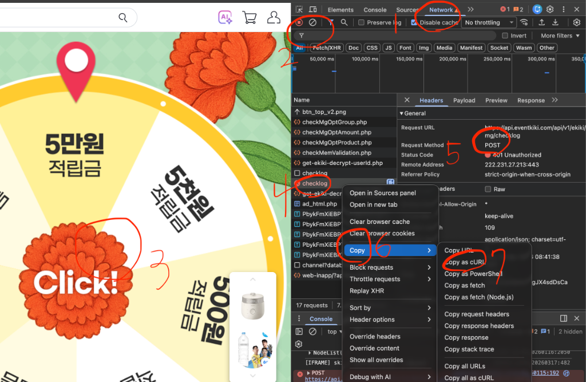

# 🌸 Curliflower (컬리플라워)

**Curliflower**는 복잡한 네트워크 요청(cURL/fetch)을 저장하고, 컴퓨터 시작 시 자동으로 실행해주는 프리미엄 자동화 도구입니다.

---

## 📅 Event Kiki 자동 출석 체크 가이드



Event Kiki 등 이벤트 페이지의 자동 출석 체크를 설정하는 방법입니다. 아래 순서대로 따라 하시면 매일 아침 자동으로 출석이 완료됩니다.

### 🔍 1단계: 네트워크 요청 추출하기 (Chrome)

0. 크롬 브라우저에서 해당 이벤트 페이지를 열고 **F12**를 누릅니다.
1. 상단 메뉴에서 **Network(네트워크)** 탭을 클릭합니다.
2. 필터(Filter) 창에 그날 최초라면 `pick`, 이미 완료했다면 `checklog`를 입력합니다.
3. 이벤트 버튼(예: Click!, 룰렛 돌리기 등)을 클릭합니다.
4. 필터링된 결과물 중 `pick` 또는 `checklog` 항목을 찾습니다.
5. 해당 항목을 클릭하여 **Request Method**가 **POST**인지 확인합니다.
6. 해당 항목 위에서 마우스 오른쪽 버튼을 클릭하여 **Copy** -> **Copy as cURL**을 선택합니다.

### 📝 2단계: 명령어 수정 (중요!)

7. 메모장에 복사한 내용을 붙여넣습니다.
8. 만약 `checklog`로 복사했다면, 주소창의 `checklog` 부분을 `pickrwd`로 수정합니다.
   - 예: `.../v1/ekiki/mg/checklog` -> `.../v1/ekiki/mg/pickrwd`
9. 수정된 전체 텍스트를 복사합니다.

### 🚀 3단계: Curliflower 앱에 등록하기

10. **Curliflower** 앱을 실행합니다.
11. 오른쪽 상단의 **+ Add Request** 버튼을 누릅니다.
12. 나타나는 입력창에 복사한 텍스트를 붙여넣습니다.
13. **Add to Queue** 버튼을 눌러 목록에 추가합니다.
14. 왼쪽 메뉴에서 **Run All Now** 또는 개별 **Run** 기능을 눌러 정상적으로 동작하는지 테스트합니다.
15. **Launch at Startup** 스위치를 켜서 매일 자동 실행되도록 설정합니다.

---

## 💻 빌드 및 실행

### 개발 환경 실행
```bash
npm install
npm start
```

### Windows/Mac용 설치 파일 빌드
```bash
npm run build
```

---

## ⚖️ 저작권 및 감사 인사

- **제작**: [krazyeom](https://github.com/krazyeom) & [그래염 (LTC)](https://cafe.naver.com/hexenyang)

---
*Made with ❤️ by krazyeom & 그래염*
